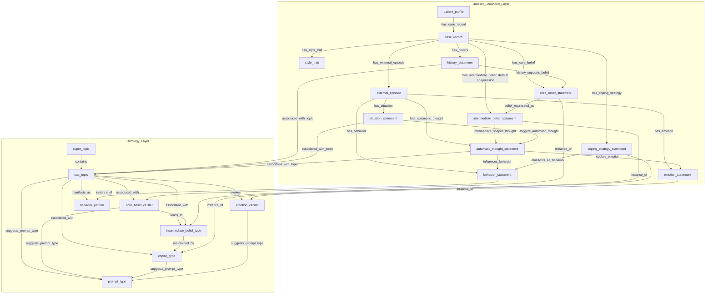

```mermaid
graph TD
  subgraph Ontology_Layer
    ST[super_topic]
    SUB[sub_topic]
    CBC[core_belief_cluster]
    IBT[intermediate_belief_type]
    CT[coping_type]
    EC[emotion_cluster]
    BP[behavior_pattern]
    PT[prompt_type]
  end

  subgraph Dataset_Grounded_Layer
    P[patient_profile]
    C[case_record]
    E[external_episode]

    T[style_trait]
    H[history_statement]
    CBS[core_belief_statement]
    IBS[intermediate_belief_statement]
    CPS[coping_strategy_statement]

    S[situation_statement]
    AT[automatic_thought_statement]
    ES[emotion_statement]
    BS[behavior_statement]
  end

  ST -->|contains| SUB
  SUB -->|associated_with| CBC
  SUB -->|associated_with| IBT
  SUB -->|associated_with| CT
  SUB -->|evokes| EC
  SUB -->|manifests_as| BP
  SUB -->|suggests_prompt_type| PT

  CBC -->|leads_to| IBT
  IBT -->|maintained_by| CT
  CBC -->|suggests_prompt_type| PT
  CT -->|suggests_prompt_type| PT
  EC -->|suggests_prompt_type| PT

  P -->|has_case_record| C
  C -->|has_external_episode| E
  C -->|has_style_trait| T

  C -->|has_history| H
  C -->|has_core_belief| CBS
  C -->|has_intermediate_belief_default / depression| IBS
  C -->|has_coping_strategy| CPS

  E -->|has_situation| S
  E -->|has_automatic_thought| AT
  E -->|has_emotion| ES
  E -->|has_behavior| BS

  H -->|history_supports_belief| CBS
  CBS -->|belief_expressed_as| IBS
  IBS -->|intermediate_shapes_thought| AT
  S -->|triggers_automatic_thought| AT
  AT -->|evokes_emotion| ES
  AT -->|influences_behavior| BS
  CPS -->|manifests_as_behavior| BS

  CBS -->|instance_of| CBC
  IBS -->|instance_of| IBT
  CPS -->|instance_of| CT
  ES -->|instance_of| EC
  BS -->|instance_of| BP

  H -->|associated_with_topic| SUB
  S -->|associated_with_topic| SUB
  AT -->|associated_with_topic| SUB

```