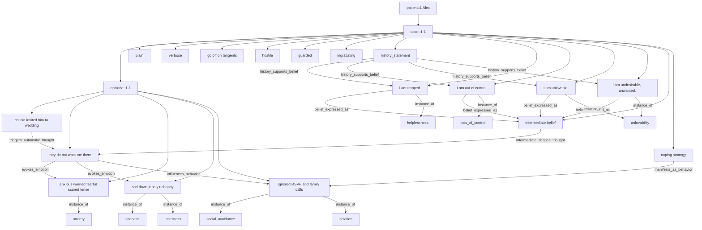

```mermaid
graph TD
  P[patient::1 Alex] --> C[case::1-1]
  C --> E[episode::1-1]

  C --> T1[plain]
  C --> T2[verbose]
  C --> T3[go off on tangents]
  C --> T4[hostile]
  C --> T5[guarded]
  C --> T6[ingratiating]

  C --> H[history_statement]
  C --> B1[I am trapped.]
  C --> B2[I am out of control.]
  C --> B3[I am unlovable.]
  C --> B4[I am undesirable, unwanted.]
  C --> IB[intermediate belief]
  C --> CP[coping strategy]

  E --> S[cousin invited him to wedding]
  E --> T[they do not want me there]
  E --> EM1[anxious worried fearful scared tense]
  E --> EM2[sad down lonely unhappy]
  E --> BH[ignored RSVP and family calls]

  H -->|history_supports_belief| B1
  H -->|history_supports_belief| B2
  H -->|history_supports_belief| B3
  H -->|history_supports_belief| B4

  B1 -->|belief_expressed_as| IB
  B2 -->|belief_expressed_as| IB
  B3 -->|belief_expressed_as| IB
  B4 -->|belief_expressed_as| IB

  IB -->|intermediate_shapes_thought| T
  S -->|triggers_automatic_thought| T
  T -->|evokes_emotion| EM1
  T -->|evokes_emotion| EM2
  T -->|influences_behavior| BH
  CP -->|manifests_as_behavior| BH

  B1 -->|instance_of| HC[helplessness]
  B2 -->|instance_of| LC[loss_of_control]
  B3 -->|instance_of| UC[unlovability]
  B4 -->|instance_of| UC
  EM1 -->|instance_of| AX[anxiety]
  EM2 -->|instance_of| SD[sadness]
  EM2 -->|instance_of| LN[loneliness]
  BH -->|instance_of| SA[social_avoidance]
  BH -->|instance_of| ISO[isolation]

```