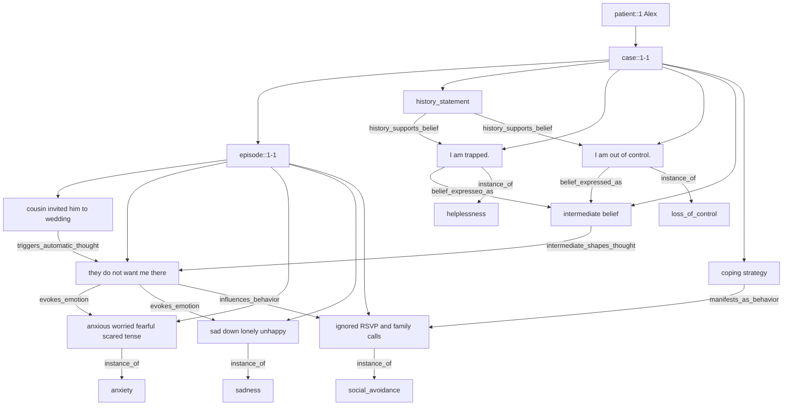

```mermaid
graph TD
  P[patient::1 Alex] --> C[case::1-1]
  C --> E[episode::1-1]

  C --> H[history_statement]
  C --> B1[I am trapped.]
  C --> B2[I am out of control.]
  C --> IB[intermediate belief]
  C --> CP[coping strategy]

  E --> S[cousin invited him to wedding]
  E --> T[they do not want me there]
  E --> EM1[anxious worried fearful scared tense]
  E --> EM2[sad down lonely unhappy]
  E --> BH[ignored RSVP and family calls]

  H -->|history_supports_belief| B1
  H -->|history_supports_belief| B2
  B1 -->|belief_expressed_as| IB
  B2 -->|belief_expressed_as| IB
  IB -->|intermediate_shapes_thought| T
  S -->|triggers_automatic_thought| T
  T -->|evokes_emotion| EM1
  T -->|evokes_emotion| EM2
  T -->|influences_behavior| BH
  CP -->|manifests_as_behavior| BH

  B1 -->|instance_of| HC[helplessness]
  B2 -->|instance_of| LC[loss_of_control]
  EM1 -->|instance_of| AX[anxiety]
  EM2 -->|instance_of| SD[sadness]
  BH -->|instance_of| SA[social_avoidance]

```