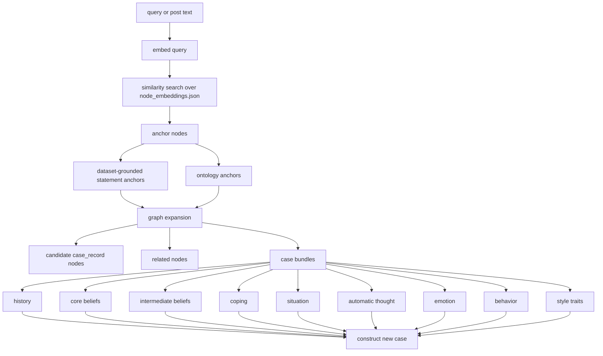

```mermaid
flowchart TD
  Q[query or post text] --> EMB[embed query]
  EMB --> ANN[similarity search over node_embeddings.json]
  ANN --> A[anchor nodes]

  A --> R1[dataset-grounded statement anchors]
  A --> R2[ontology anchors]

  R1 --> EXP[graph expansion]
  R2 --> EXP

  EXP --> CASE[candidate case_record nodes]
  EXP --> REL[related nodes]
  EXP --> BUNDLE[case bundles]

  BUNDLE --> OUT1[history]
  BUNDLE --> OUT2[core beliefs]
  BUNDLE --> OUT3[intermediate beliefs]
  BUNDLE --> OUT4[coping]
  BUNDLE --> OUT5[situation]
  BUNDLE --> OUT6[automatic thought]
  BUNDLE --> OUT7[emotion]
  BUNDLE --> OUT8[behavior]
  BUNDLE --> OUT9[style traits]

  OUT1 --> CONSTRUCT[construct new case]
  OUT2 --> CONSTRUCT
  OUT3 --> CONSTRUCT
  OUT4 --> CONSTRUCT
  OUT5 --> CONSTRUCT
  OUT6 --> CONSTRUCT
  OUT7 --> CONSTRUCT
  OUT8 --> CONSTRUCT
  OUT9 --> CONSTRUCT

```