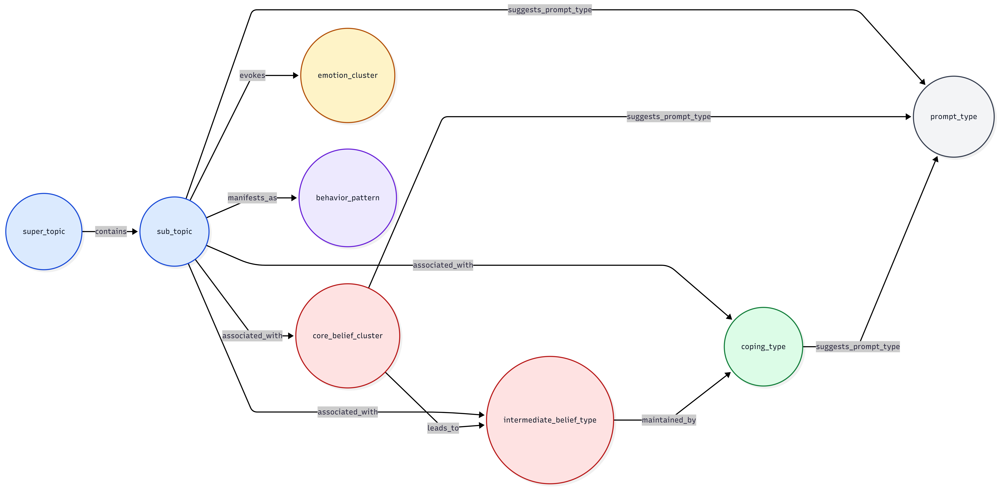

# Topic Graph Weight Justification

This note explains the current edge-weight design used in the CBT topic graph. A high-level view of the schema is shown in [topic_graph.png](/home/lu/Thesis/mind_voyager/topic_graph.png).

  

## Purpose

The current weights are theory-informed priors. They are not learned probabilities. Their role is to bias graph expansion toward relationships that are more central, stable, and clinically meaningful in the CBT formulation structure.

In retrieval, the weights help distinguish:

- strong structural links
- moderate conceptual links
- weaker advisory links used for prompt guidance

The important design choice is the relative ordering of the weights, not a claim that each number is an exact empirical value.

## Current Weight Rationale

- `contains = 1.0`
  - This is a taxonomic relation between a `super_topic` and a `sub_topic`.
  - It is treated as deterministic membership rather than a soft association.

- `associated_with = 0.9`
  - Used when a `sub_topic` is strongly characteristic of a `core_belief_cluster`.
  - This is one of the strongest non-taxonomic links in the graph because it captures a central conceptual connection.

- `associated_with = 0.8`
  - Used for important but slightly less defining links, such as from `sub_topic` to `intermediate_belief_type` or `coping_type`.
  - These links are still clinically meaningful, but less central than the strongest topic-to-core-belief associations.

- `evokes = 0.75`
  - Used for `sub_topic -> emotion_cluster`.
  - Emotional responses are important and common, but more context-sensitive than structural topic-to-belief relations.

- `manifests_as = 0.75`
  - Used for `sub_topic -> behavior_pattern`.
  - Behavioral expressions are clinically useful but can vary substantially across clients, so they are weighted as moderate-strength links.

- `suggests_prompt_type = 0.7`
  - Used for direct prompt suggestions from `sub_topic`.
  - These are useful therapist-facing recommendations, but they are advisory rather than factual.

- `leads_to = 0.7`
  - Used for `core_belief_cluster -> intermediate_belief_type`.
  - This reflects the CBT idea that deeper beliefs often give rise to conditional assumptions or rules.

- `maintained_by = 0.7`
  - Used for `intermediate_belief_type -> coping_type`.
  - This captures maintenance patterns in which coping styles help preserve underlying assumptions.

- `suggests_prompt_type = 0.65`
  - Used for additional prompt links from `core_belief_cluster`, `coping_type`, and `emotion_cluster`.
  - These links remain useful, but they are deliberately weaker than structural conceptual links so that prompt recommendations do not dominate graph reasoning.

## Why This Ordering Was Chosen

The current scheme preserves the following intended ordering:

- `contains`
- strong conceptual association
- moderate emotional and behavioral expression
- prompt recommendation

This helps retrieval favor the conceptual neighborhood of a topic before favoring optional prompt suggestions.

## Interpretation

These weights should be interpreted as design priors for retrieval and expansion. They make the graph more interpretable and easier to reason about, but they are still heuristic. Future work could calibrate or learn these values from retrieval quality or downstream dialogue performance.
